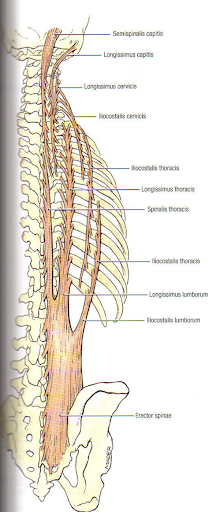
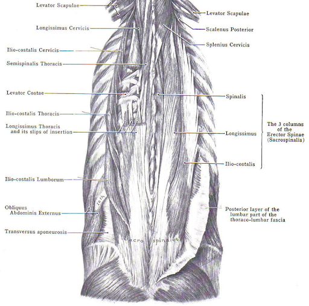

# Lumbar Musculature
 
## Lumbar Multifidus (LM)
 
(Macintosh et al. 1986, Netter FH. 2014)
 
 
The multifidus is a deep local spinal muscle that spans the entire length of the spine. The multifidus muscle originates on the transverse processes and inserts 
onto the spinous process of the vertebrae above, spanning 1-3 segments depending on whether you are looking at the deep, intermediate, or superficial fibres.
The lumbar portion is found on either side of the lumbar vertebrae (L1-L5). LM has been shown to provide segmental stabilization at rest and proprioceptive control
during movement, in addition to playing a key role in the transferral of forces from the lower extremities through the kinetic chain.
 

 
## Erector Spinae (ES)
 
(Daggfeldt et al. 2000, Netter FH. 2014)
 
 
The erector spinae group is composed of the iliocostalis, longissimus, and spinalis muscle groups. In the lumbar spine, it is primarily composed of the 
iliocostalis and longissimus groups. The iliocostalis lumborum (the lumbar section of the iliocostalis group) originates on the lateral crests of the sacrum,
the dorsal sacroiliac, inferior oblique, and sacrotuberous ligaments, the posterior aspect of the medial lip of the iliac crest, the spinous processes of T11-L5,
and the supraspinous ligament. It extends up the back to insert into the inferior border of the angles of the lower 6 or 7 ribs. The longissimus thoracis blends with 
the iliocostalis lumborum in the lumbar region, sharing an origin, as well as originating on the posterior surfaces of the transverse and accessory processes of the 
lumbar vertebrae and the anterior layer of the thoracolumbar fascia. This muscle then inserts onto the tips of the thoracic transverse processes all the way up to T2 as
well as into the lower 9 or 10 ribs between the tubercles and angles. Both the iliocostalis lumborum and longissimus thoracis muscles perform trunk extension when 
working bilaterally and sidebending when activating unilaterally.
 

  
  

 
## Quadratus Lumborum (QL)
 
(Phillips et al.  2008, Netter FH. 2014)
 
 
The quadratus lumborum originates on the superior and posterior aspect of the iliolumbar ligament, the middle part of the posterior aspect of the iliac crest, 
and the thoracolumbar fascia. It inserts onto the lower border of the 12th rib and the transverse processes of L1-L4. QL aids in trunk extension bilaterally, 
sidebending unilaterally, and respiration. In addition, it is known to help stabilize the trunk during gait due to its attachments to the pelvic girdle.
 
 
## Psoas
 
(Faisal et al. 2017, Netter FH. 2014)
 
 
Psoas originates on the anterior aspect of the transverse processes, vertebral bodies, and intervertebral discs of T12-L5. It passes anterior to the hip joint
capsule to insert onto the lesser trochanter of the femur. The psoas muscle performs hip flexion and aids in flexion of the trunk and pelvis when working bilaterally.
Due to its origins, psoas is closely related to the diaphragm and viscera in the area.
 
 
## Segmentations
Lumbar musculature differs from level to level, side to side, between males and females, with age, and with disability. It is important to be able to know the
borders of muscles in order to recognize these differences and make comparisons. In the example segmentations, you can see how the size of the multifidus muscle
increases in the caudal direction, while the size of the erector spinae decreases. Furthermore, the quadratus lumborum is no longer visible at the L5/S1 level due
to its anatomical insertion points. When comparing the control to the individual with low back pain (LBP), there is an increase in the presence of intramuscular fat.
Intramuscular fat also increases with age. Females generally have higher levels of fat compared to males which is observed by the greater amount of white in the
muscle (intramuscular fat) and around the muscle (epimuscular fat).
  
To see a video of the segmentation process for these muscles <a href='https://projectpillar.github.io/Muscular_Anatomy/ITK-SNAP%20tutorial%20videos.html#videos'><u>click here</u></a>.

