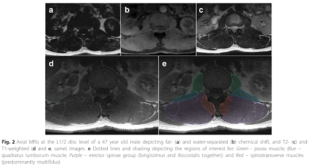
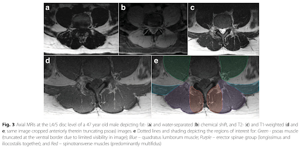

# Muscular Borders
 
## Lumbar Multifidus (LM) 

(Crawford et al. 2017, Cooley et al. 2021)
 
<ul>
<li><b>Medial border</b> - most superficial aspect of the spinous process as it leads into the lamina including any fat located along the spinous process</li>
<li><b>Anterior border</b> - follow the lamina towards the zygapophyseal joint</li>
<li><b>Lateral border</b> - intermuscular fascial line between LM and ES from the mammillary process to the small visible indentation in the 
  subcutaneous tissue along the posterior aspect</li>
<li><b>Posterior border</b> - along the LM epimysium that is distinct from the thoracolumbar fascia (TLF) and adjacent adipose tissue</li>
  </ul>
 
Remember, the fat next to the spinous process is included as part of the LM segmentation. If there is increased fat along the lateral border (i.e. between LM and ES), this fat <b>is not</b> included as part of the LM segmentation. If there is little fat along the lateral border and it is hard to distinguish between what is LM and what is ES, look for small pockets of fat where the anterior and lateral borders meet or where the posterior and lateral borders meet to see the beginnings of a thin white line - the trajectory can be followed through the dark patches to assume the lateral border. Ensure the lateral border is the fascial border between LM and ES and not the border between the longissimus and iliocostalis muscles that make up the ES.
 
## Erector Spinae (ES) 

(Crawford et al. 2017)
 
<ul>
<li><b>Medial border</b> - intermuscular fascial line between LM and ES to the zygapophyseal joint or mammillary process</li>
<li><b>Anterior border</b> - along the TP and intermusuclar fascial border between ES and QL</li>
<li><b>Lateral border</b> - rounded edge of the fascial border of the iliocostalis muscle</li>
<li><b>Posterior border</b> - along the ES muscle and aponeurosis which is distinct from the TLF and adjacent subcutaneous adipose tissue</li>
  </ul>
 
Remember, if fat has accumulated along the medial border (i.e. between LM and ES), this fat is included as part of the ES segmentation. The anterior border leading towards the lateral border runs along the QL. Sometimes there is a clear line to separate the two, sometimes there is not. If the border is not clear, follow the rounded edge at the lateral border and work towards the anterior border at the tip of the zygapophyseal joint. This point of ES may also come into contact with the posterior border of the psoas muscle in the upper lumbar levels. For the posterior border of the ES, it is still debated whether to include the epimuscular fat or not (the white fat-filled “tents” between longissimus and iliocostalis or it may span the length of the posterior border). <u>Please take a look at the “epimuscular fat band” section to learn more about the inclusion and exclusion of this portion.</u>
 
## Quadratus Lumborum (QL) 

(Crawford et al. 2017)
 
<ul>
<li><b>Medial border</b> - may extend all the way towards the mammillary process at the tip of the ES border or may come to a point meeting psoas and ES depending on the lumbar level investigated</li>
<li><b>Anterior border</b> - intermuscular fascial line between QL and psoas</li>
<li><b>Lateral border</b> - 12th rib at the level of L1, posterior perirenal fascia at the level of L2-L4, iliac crest at the level of L4</li>
<li><b>Posterior border</b> - intermuscular fascial line between QL and ES</li>
</ul>
 
Remember, QL is generally an elongated muscle with the posterior border being straight. If the border is not clear, follow the line of the small fat accumulation where the lateral and posterior borders meet with ES. At L5, QL is no longer visible on images due to its insertion point being the superior aspect of the iliac crest.
 
## Psoas 

(Crawford et al. 2017)
 
<ul>
<li><b>Medial border</b> - the intervertebral disc</li>
<li><b>Anterior border</b> - interfascial border with the viscera and may border several blood vessels (e.g. splenic artery, inferior vena cava, etc) depending on the level and whether on the right or left side</li>
<li><b>Lateral border</b> - approximately L1-L4 borders the kidneys, L5 borders the posterior perirenal fascia</li>
<li><b>Posterior border</b> - intermuscular fascial line between psoas and either QL or ES depending on the shape of the muscles in the image and the lumbar level in question</li>
  </ul>
 
Remember, psoas is generally round with a possible elongation at the posterior border at the lower lumbar levels. At the upper lumbar levels, psoas may be more narrow as the muscle begins at L1-L3.
  
Images from Crawford et al. 2017 article depicting segmentations at 2 different levels:
  

 

  
To see segmentations from L1-L5 in a female control, age-matched female with low back pain, and an elderly female, <a href='https://projectpillar.github.io/Scans/L1-L5%20Segmentations.html'><u>click here</u></a>. 
To see segmentations from L1-L5 in a male control, age-matched male with low back pain, and an elderly male, <a href='https://projectpillar.github.io/Scans/L1-L5%20Segmentations.html#male'><u>click here</u></a>. 
 

