# Segmentation Scans

## Female Segmentation

### L1/L2

The following MRI images are separated into three columns. The first column contains images from a 27 year old female control (no LBP). 
The second column contains images from a 32 year old female with LBP. The final column contains images from a 51 year old female with LBP. 
T2 weighted images are presented first with water and fat images following  their respective levels. Segmentations of multifidus (red), erector spinae (green), 
quadratus lumborum (blue), and psoas (yellow) are presented underneath their respective images.

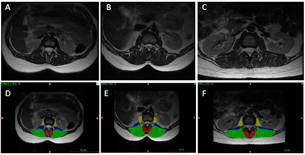
<b>Figure 1</b>: All images are T2-weighted images at the L1/L2 level. The first column (A & D) are images of the control.
The middle column (B & E) are images of an age-matched individual with LBP. The third column (C & F) are images of the older individual with LBP. 
D, E, and F include the segmentations of the lumbar multifidus (red), erector spinae (green), quadratus lumborum (blue), and psoas (yellow) muscles.

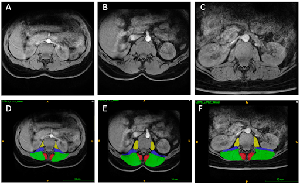
<b>Figure 2</b>: All images are water images at the L1/L2 level. The first column (A & D) are images of the control. The middle column (B & E) are images of an age-matched individual with LBP. The third column (C & F) are images of the older individual with LBP. D, E, and F include the segmentations of the lumbar multifidus (red), erector spinae (green), quadratus lumborum (blue), and psoas (yellow) muscles.

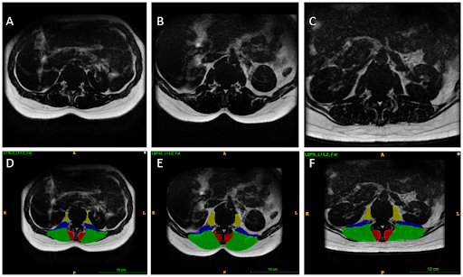
<b>Figure 3</b>: All images are fat images at the L1/L2 level. The first column (A & D) are images of the control. The middle column (B & E) are images of an age-matched individual with LBP. The third column (C & F) are images of the older individual with LBP. D, E, and F include the segmentations of the lumbar multifidus (red), erector spinae (green), quadratus lumborum (blue), and psoas (yellow) muscles.

### L2/L3

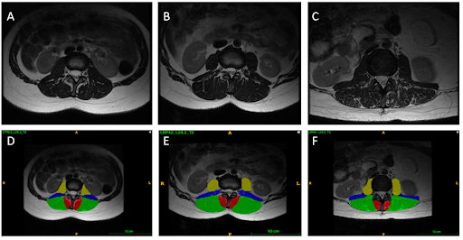
<b>Figure 4</b>: All images are T2-weighted images at the L2/L3 level. The first column (A & D) are images of the control. The middle column (B & E) are images of an age-matched individual with LBP. The third column (C & F) are images of the older individual with LBP. D, E, and F include the segmentations of the lumbar multifidus (red), erector spinae (green), quadratus lumborum (blue), and psoas (yellow) muscles.

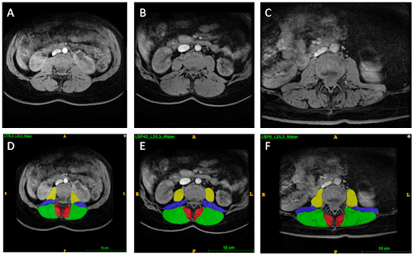
<b>Figure 5</b>: All images are water images at the L2/L3 level. The first column (A & D) are images of the control. The middle column (B & E) are images of an age-matched individual with LBP. The third column (C & F) are images of the older individual with LBP. D, E, and F include the segmentations of the lumbar multifidus (red), erector spinae (green), quadratus lumborum (blue), and psoas (yellow) muscles.

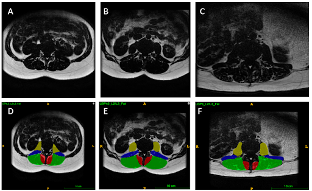
<b>Figure 6</b>: All images are fat images at the L2/L3 level. The first column (A & D) are images of the control. The middle column (B & E) are images of an age-matched individual with LBP. The third column (C & F) are images of the older individual with LBP. D, E, and F include the segmentations of the lumbar multifidus (red), erector spinae (green), quadratus lumborum (blue), and psoas (yellow) muscles.

### L3/L4

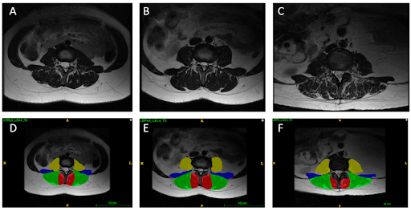
<b>Figure 7</b>: All images are T2-weighted images at the L3/L4 level. The first column (A & D) are images of the control. The middle column (B & E) are images of an age-matched individual with LBP. The third column (C & F) are images of the older individual with LBP. D, E, and F include the segmentations of the lumbar multifidus (red), erector spinae (green), quadratus lumborum (blue), and psoas (yellow) muscles.

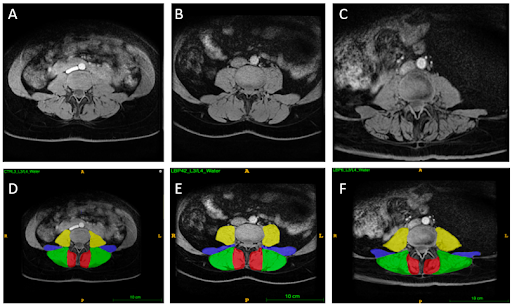
<b>Figure 8</b>: All images are water images at the L3/L4 level. The first column (A & D) are images of the control. The middle column (B & E) are images of an age-matched individual with LBP. The third column (C & F) are images of the older individual with LBP. D, E, and F include the segmentations of the lumbar multifidus (red), erector spinae (green), quadratus lumborum (blue), and psoas (yellow) muscles.

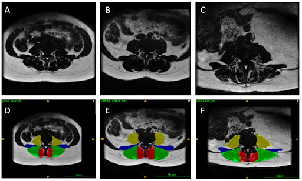
<b>Figure 9</b>: All images are fat images at the L3/L4 level. The first column (A & D) are images of the control. The middle column (B & E) are images of an age-matched individual with LBP. The third column (C & F) are images of the older individual with LBP. D, E, and F include the segmentations of the lumbar multifidus (red), erector spinae (green), quadratus lumborum (blue), and psoas (yellow) muscles.

### L4/L5

<b>Figure 10</b>: All images are T2-weighted images at the L4/L5 level. The first column (A & D) are images of the control. The middle column (B & E) are images of an age-matched individual with LBP. The third column (C & F) are images of the older individual with LBP. D, E, and F include the segmentations of the lumbar multifidus (red), erector spinae (green), quadratus lumborum (blue), and psoas (yellow) muscles.

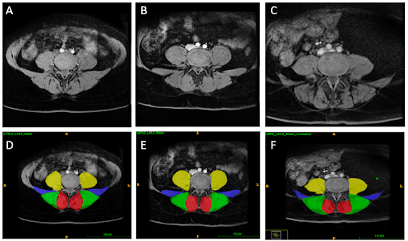
<b>Figure 11</b>: All images are water images at the L4/L5 level. The first column (A & D) are images of the control. The middle column (B & E) are images of an age-matched individual with LBP. The third column (C & F) are images of the older individual with LBP. D, E, and F include the segmentations of the lumbar multifidus (red), erector spinae (green), quadratus lumborum (blue), and psoas (yellow) muscles.

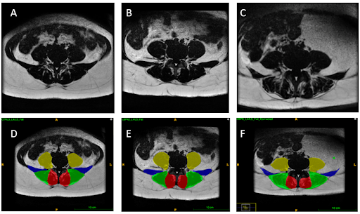
<b>Figure 12</b>: All images are fat images at the L4/L5 level. The first column (A & D) are images of the control. The middle column (B & E) are images of an age-matched individual with LBP. The third column (C & F) are images of the older individual with LBP. D, E, and F include the segmentations of the lumbar multifidus (red), erector spinae (green), quadratus lumborum (blue), and psoas (yellow) muscles.
