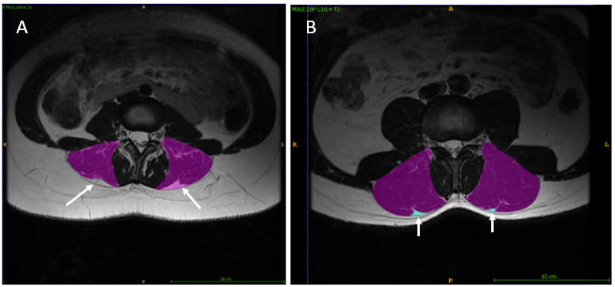
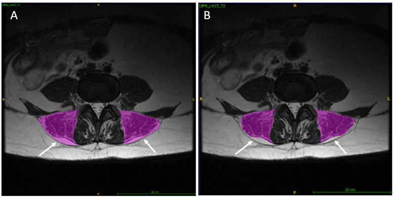

# Epimuscular Fat

The following images depict some of the variability that may be encountered with the presence of epimuscular fat when segmenting.

In the first image at the L3/L4 level (control), the ES on the left side of the image is segmented <b>without</b> the epimuscular fat and the ES on the right side of the image <b>includes</b> the epimuscular fat band. This visual demonstrates how the cross-sectional area and signal intensity of the muscle in question would no doubt differ if the researcher chose to include or not include the epimuscular fat band. This further reiterates the importance of creating standardized segmentation for more accurate comparisons between studies.

  

The second image at the L3/L4 level (LBP) provides a visual of smaller epimuscular fat “tents” (in light blue) that arise between iliocostalis and longissimus muscles.

In this example at the L4/L5 level, both images on the left and right are the same, however the left image depicts the inclusion of epimuscular fat and the right image depicts the exclusion of epimuscular fat. The ES on the left side clearly has a larger amount of epimuscular fat compared to the ES on the right side of the image. Even within the same person, the amount of epimuscular fat may differ from side to side and level to level (generally increasing caudally). Other trends observed with epimuscular fat include increased amounts in females compared to males and increased amounts in older populations compared to younger.

  

Comparing the images provided here, epimuscular fat may span the length of the ES muscle, or may only form as a “tent” between iliocostalis and longissimus.
