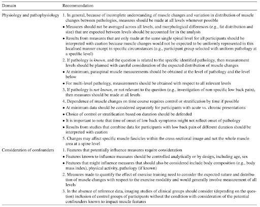
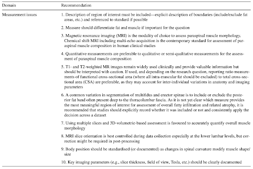

# List of published standardized recommendations for back muscle imaging

As back muscle imaging research is becoming more prevalent, Hodges et al. (2021) provided a set of recommendations to help standardize paraspinal muscle imaging. Please see the table below for those recommendations

Table from Hodges et al. 2021

